# Greenlake Cloud Platform (GLCP): Configuring Azure AD as the SAML IDP with Aruba Central


Single sign-on (SSO) enables users to securely authenticate with multiple applications and websites by logging in only once—with just one set of credentials (username and password). With SSO, the application or website that the user is trying to access relies on a trusted third party (Identity provider) to verify that users are who they say they are.

This is the general process for configuring Azure AD to authenticate users into Greenlake Cloud Platform (GLCP) and Aruba Central using SAML IDP.

The Okta version of this guide can be found on [WIFI-GUYS](https://www.wifi-guys.com/?p=512)
<!-- prettier-ignore-start -->
## Contents

- [Greenlake Cloud Platform (GLCP): Configuring Azure AD as the SAML IDP with Aruba Central](#greenlake-cloud-platform-glcp-configuring-azure-ad-as-the-saml-idp-with-aruba-central)
	- [Contents](#contents)
	- [Before you Begin](#before-you-begin)
	- [Steps to Configure SSO/SAML Application in Azure AD](#steps-to-configure-ssosaml-application-in-azure-ad)
	- [Step 1: Create an Azure AD Enterprise Application](#step-1-create-an-azure-ad-enterprise-application)
	- [Step 2: Configure GCLP for SAML Federation](#step-2-configure-gclp-for-saml-federation)
	- [Login to GLCP and Aruba Central using Azure AD](#login-to-glcp-and-aruba-central-using-azure-ad)
	- [Using Azure AD MFA](#using-azure-ad-mfa)
	- [Troubleshooting](#troubleshooting)
	- [Appendix: Generating the `hpe_ccs_attribute`](#appendix-generating-the-hpe_ccs_attribute)
<!-- prettier-ignore-end -->

## Before you Begin
This document references the following documentation:

* [HPE Greeenlake User Guide](https://support.hpe.com/hpesc/public/docDisplay?docLocale=en_US&docId=ccs-help_en_us)

* [Single sign-on (SS) authentication](https://support.hpe.com/hpesc/public/docDisplay?docLocale=en_US&docId=a00092451en_us&page=GUID-CD81FAF8-9601-4773-899F-049A506FEE2E.html)

* [HPE Greenlake Platform Guide](https://support.hpe.com/hpesc/public/docDisplay?docLocale=en_US&docId=a00120892en_us)

**If you're looking for the Central 2.5.4 SAML integration guide, [it has been moved](https://github.com/michaelrosejr/arubasso/tree/main/Central254).**


## Steps to Configure SSO/SAML Application in Azure AD
To configure SSO in Aruba Central, first download the metadata file from Azure AD.


<ol>
<li>Create an Enteprise Application in the [Azure Portal](https://portal.azure.com)</li>
<li>Configure the Enterprise Application for GLCP</li>
<li>Download the federated metadata XML file from Enterprise Application</li>
<li>Claim and Configure your domain within GLCP
<li>Upload the federated metadata XML file to GLCP </li>
<li>Create recovery account</li>
</ol>

## Step 1: Create an Azure AD Enterprise Application


* Log into to Azure portal.

* Click **Enterprise Applications** (you may need to search for it, if it's not on your menu)

* Click **New Application**
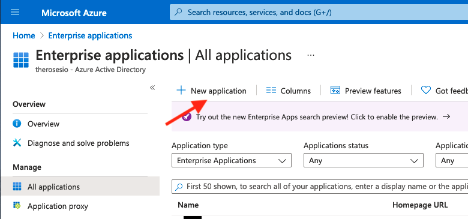

* Click **Create your own Application**
  
  Enter the name of your app. (Ex: Aruba Central USWEST 4)
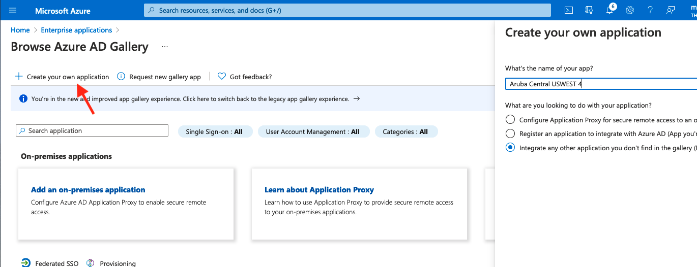
* Select **Integrate any other application you don't find in the gallery (Non-gallery)**
* Under Step 1: Assign users and groups, select the AD Group you created at the beginning of this document.
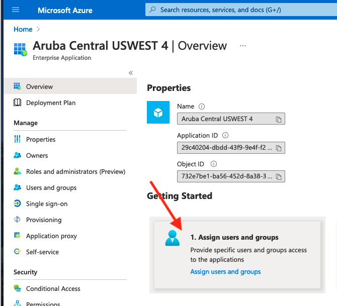
* Under Step 2: Set Up Signle sign on
* The default setting is Disabled. Select **SAML** 
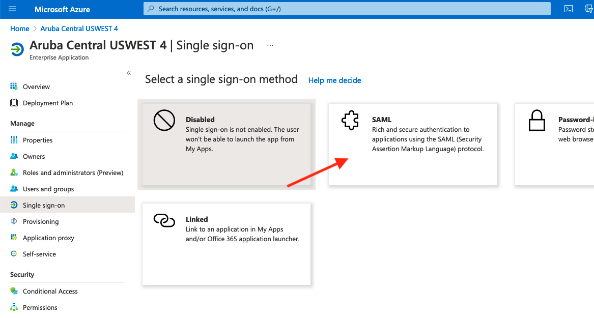
* Under Basic SAML Configuration, click **Edit**


	|                   Attribute                     |              Values                           |
	|-------------------------------------------------|-----------------------------------------------|
	| **Identifier (Entity ID):**                     | https://sso.common.cloud.hpe.com              |
	| **Reply URL (Assertion Consumer Service URL):** | https://sso.common.cloud.hpe.com/sp/ACS.saml2 |


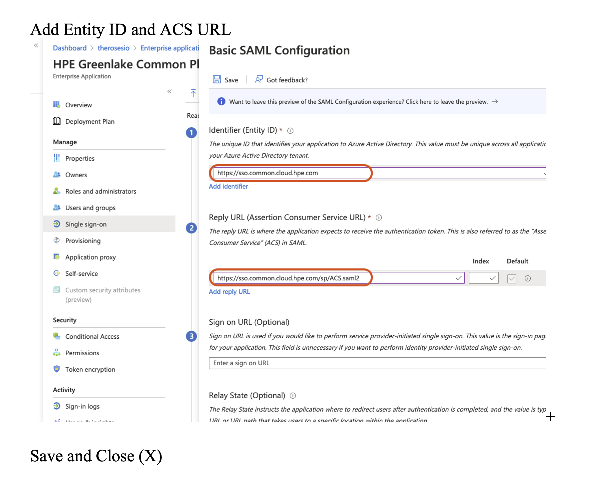

* Under Attributes & Claims

	| Attribute           | Value                  |
	|---------------------|------------------------|
	| emailaddress        | user.givenname         |
	| name                | user.userprincipalname |
	| gl\_first\_name     | user.givenname         |
	| gl\_last\_name      | user.surname           |
	| hpe\_ccs\_attribute | See Below              |
		
	```
	version_1#2fd5f97acbc211ecadc006baf610dd36:00000000-0000-0000-0000-000000000000:Account Administrator:ALL_SCOPES:683da368-66cb-4ee7-90a9-ec1964768092:Aruba Central Administrator:ALL_SCOPES
	
	Where the PCID (2fd5f97acbc211ecadc006baf610dd36) is your ID for GLCP
	and App ID (683da368-66cb-4ee7-90a9-ec1964768092) for your Central cluster
	
	```

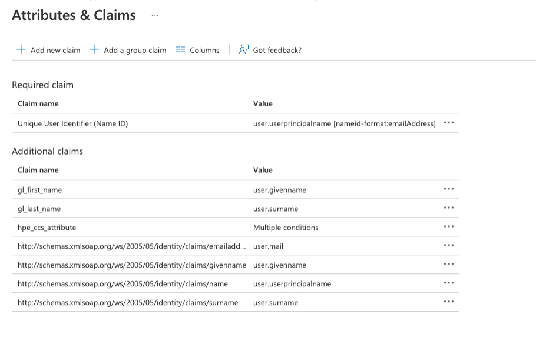


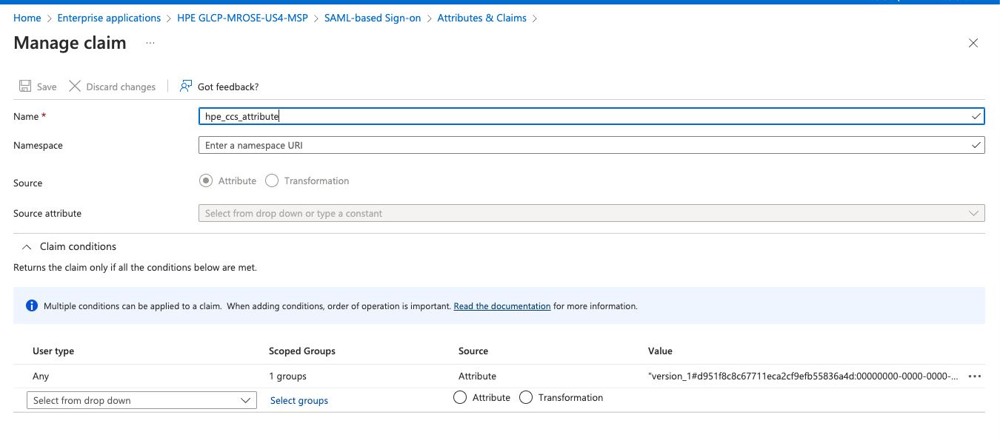


* Click **Download** under Step 3 : Federation Metadata XML

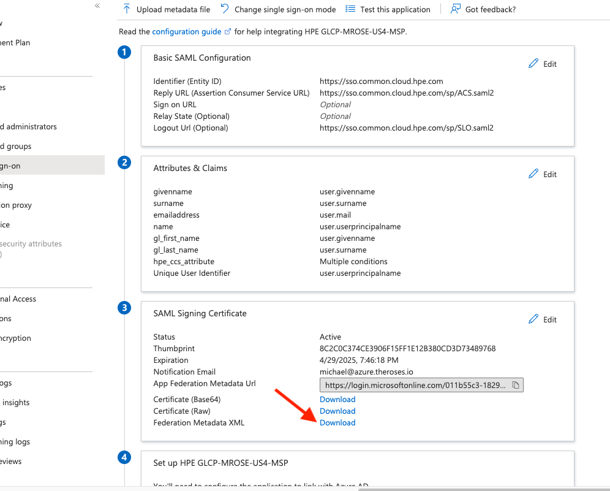

## Step 2: Configure GCLP for SAML Federation
* Login to GLCP and select Manage

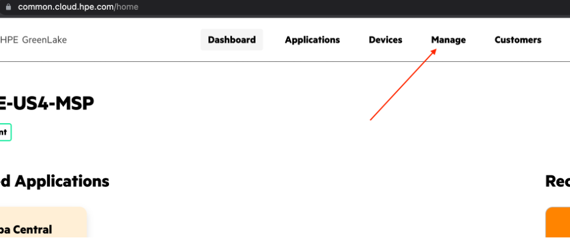

* Select the Authentication tile

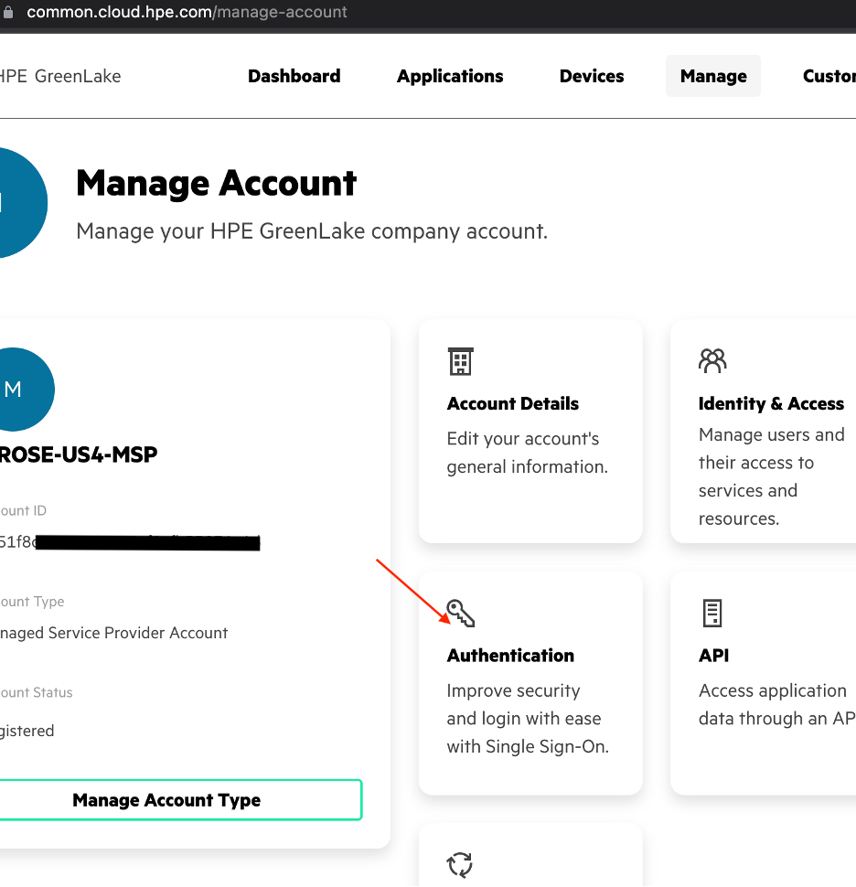

* Claim your domain for SAML

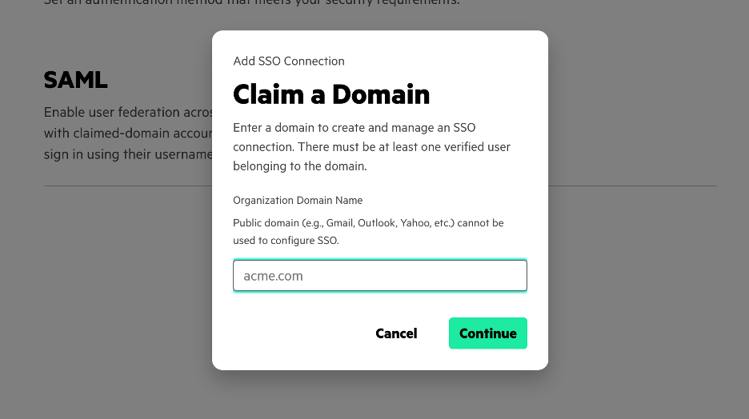

* Upload the _Federation Metadata XML_ file from the previous section.

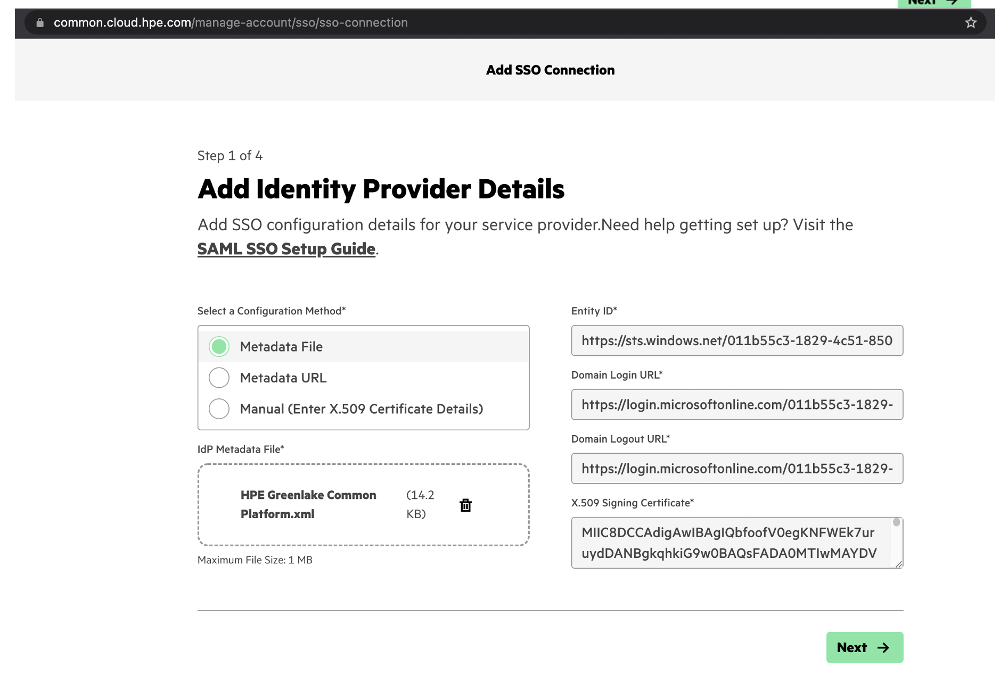

* Apply the following configuration settings. These should match the First and Last Name settings you set above for Azure.

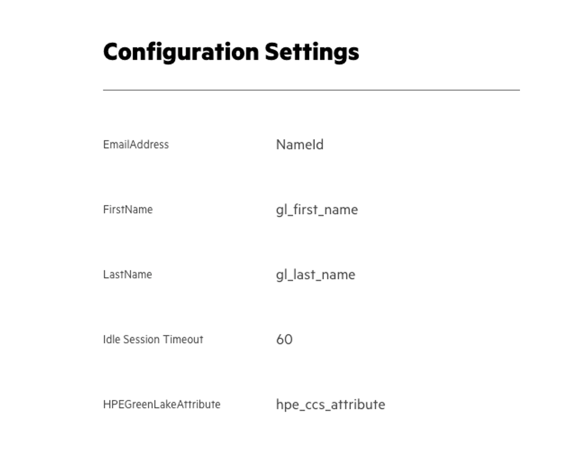

* Create teh recovery user per the instructions
* Validate the settings are correct
* Save and Finish the configruation.
* If you get an error that the SAML configuraiton wasn't completed using the account with the @domain.com. You'll have to log back up and login with the SAML domain and go through the above configuration again.

## Login to GLCP and Aruba Central using Azure AD
* Once you've completed the above steps, login to central using your Azure AD email.

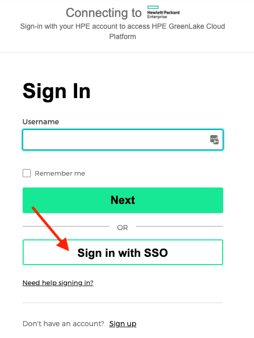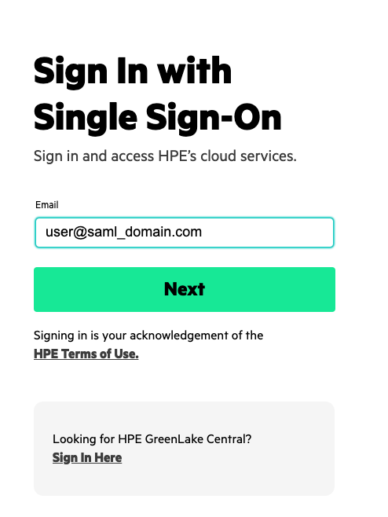
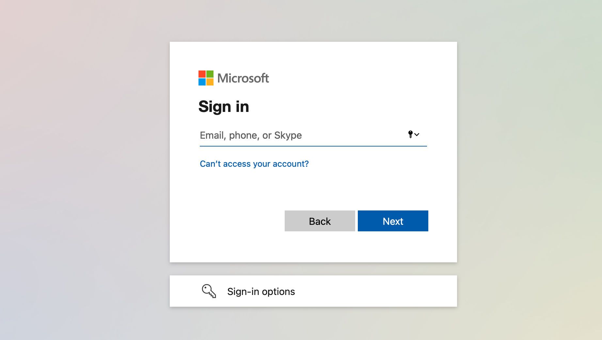

* If everything is working correctly, you should have logged into GLCP and Aruba Central is an option to Launch.

## Using Azure AD MFA
* By default, Azure AD enables MFA. However, for testing and demos, it's much easier to disable MFA on your accounts. To disable MFA, please see the following documentation: [What are security defaults](https://docs.microsoft.com/en-us/azure/active-directory/fundamentals/concept-fundamentals-security-defaults)

## Troubleshooting
* There's a useful 3rd party browser tool called: SAML Tracer
* This tool will allow you to verify the attributes you're sending to Central.
* It can be useful when configuratin SAML with multiple Central accounts or domains
* SAML Tracer
[Chrome](https://chrome.google.com/webstore/detail/saml-tracer/mpdajninpobndbfcldcmbpnnbhibjmch?hl=en)
[FireFox](https://addons.mozilla.org/en-US/firefox/addon/saml-tracer/)

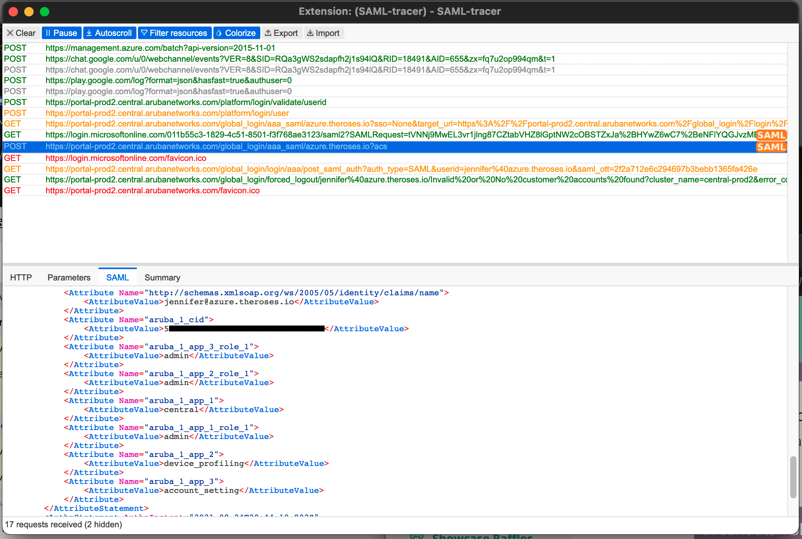


## Appendix: Generating the `hpe_ccs_attribute`

The `hpe_ccs_attribute` is used to determine your GLCP account.  The format for the `hpe_ccs_attribute` is as follows:

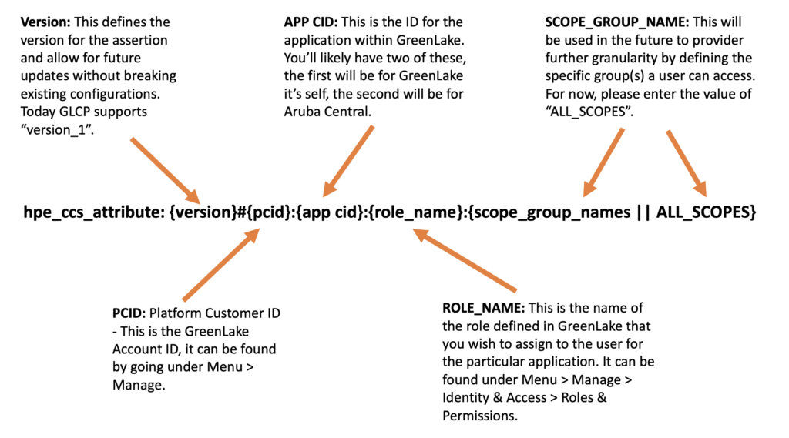

An Example `hpe_ccs_attribute` for a single GLCP and Aruba Central account would be:

```
version_1#2fd5f97acbc211ecadc006baf610dd36:00000000-0000-0000-0000-000000000000:Account Administrator:ALL_SCOPES:683da368-66cb-4ee7-90a9-ec1964768092:Aruba Central Administrator:ALL_SCOPES
```

or

```
version_1#5b0ec0e8b4f411eca432ba72799953ac:00000000-0000-0000-0000-000000000000:Account Administrator:ALL_SCOPES:683da368-66cb-4ee7-90a9-ec1964768092:Aruba Central Administrator:ALL_SCOPES#090480bc9d0c11ecb23dda25c6ddbc41:00000000-0000-0000-0000-000000000000:Account Administrator:ALL_SCOPES
```

If you're a Managed Service Provider (MSP), then the `hpe_ccs_attribute` for Administrator rights to GLCP and Aruba Central for all customer tenant accounts:

```
version_1#d951f8c8c67711eca2cf9efb55836a4d:00000000-0000-0000-0000-000000000000:Account Administrator|TENANT|:ALL_SCOPES:00000000-0000-0000-0000-000000000000:Account Administrator|MSP|:ALL_SCOPES:683da368-66cb-4ee7-90a9-ec1964768092:Aruba Central Administrator|TENANT| : ALL_SCOPES:683da368-66cb-4ee7-90a9-ec1964768092:Aruba Central Administrator|MSP| : ALL_SCOPES
```

The `hpe_ccs_attribute` string for a tenant under a MSP account, would be below. However, you **must** have the SAML domain configuration configured for that tenant account using the **same** setting as the MSP account. To say it another way, you **must** go through this configuration for each tenant account under the MSP.

```
version_1#f9ee1cdecc1611ecb00e9e24ed17d2a7:00000000-0000-0000-0000-000000000000:Observer|TENANT| :ALL_SCOPES:683da368-66cb-4ee7-90a9-ec1964768092:Aruba Central Administrator|TENANT| :ALL_SCOPES
```


