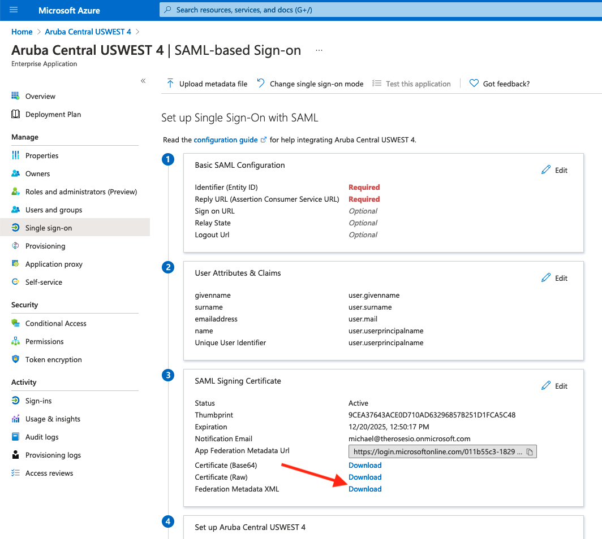
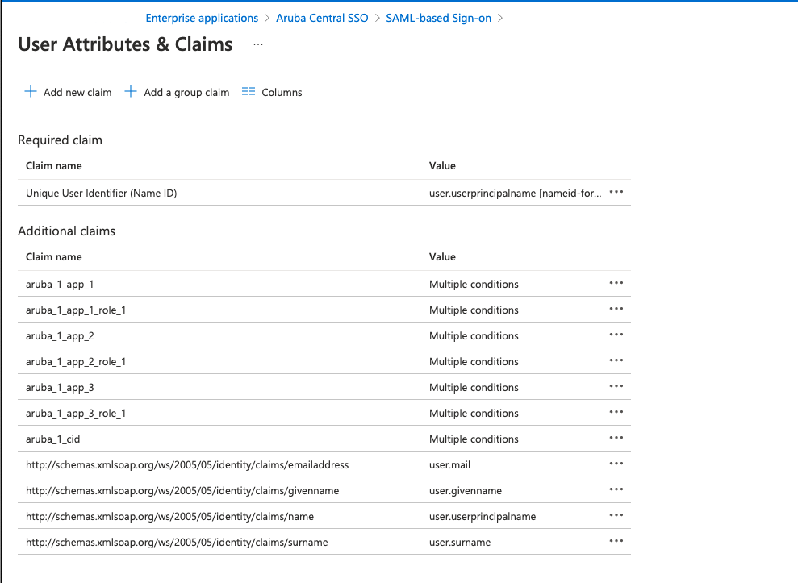
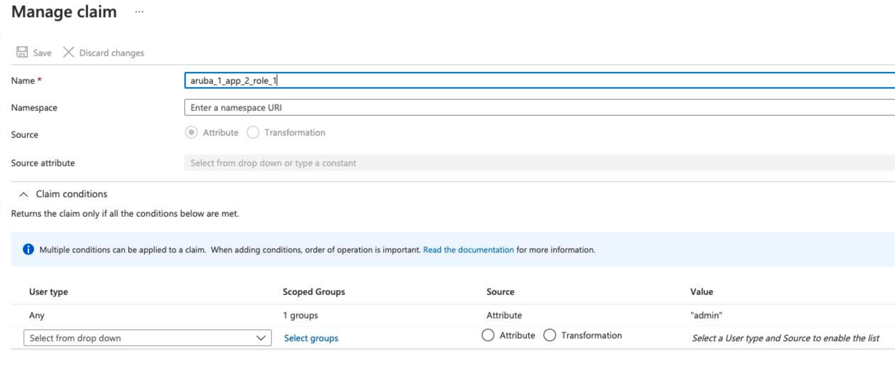
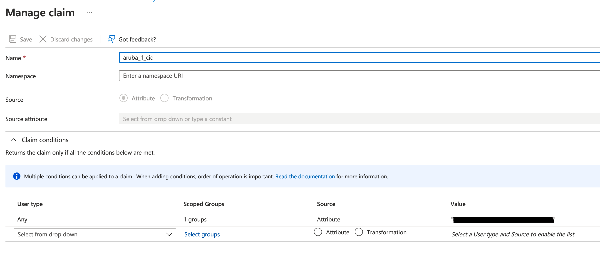
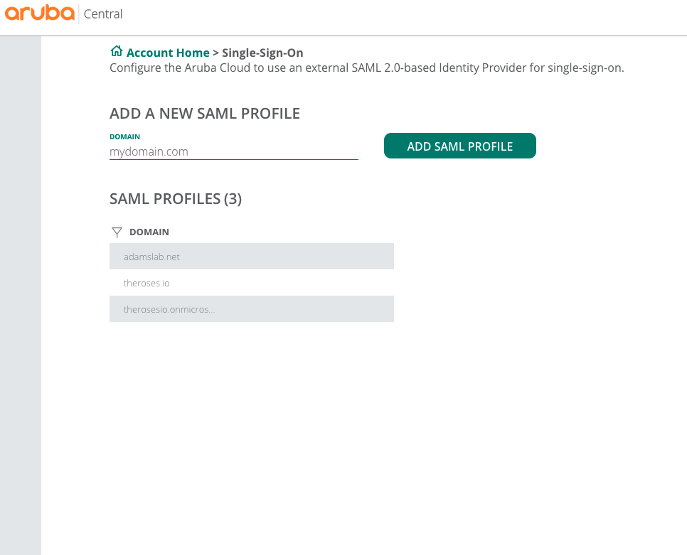
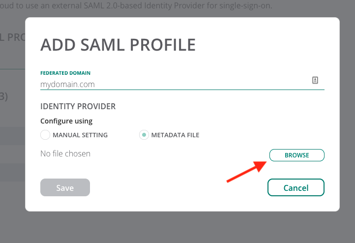
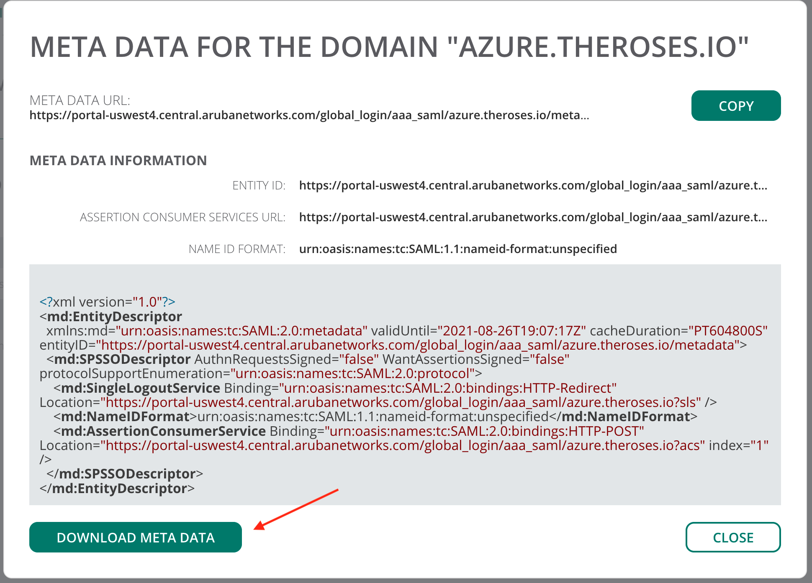
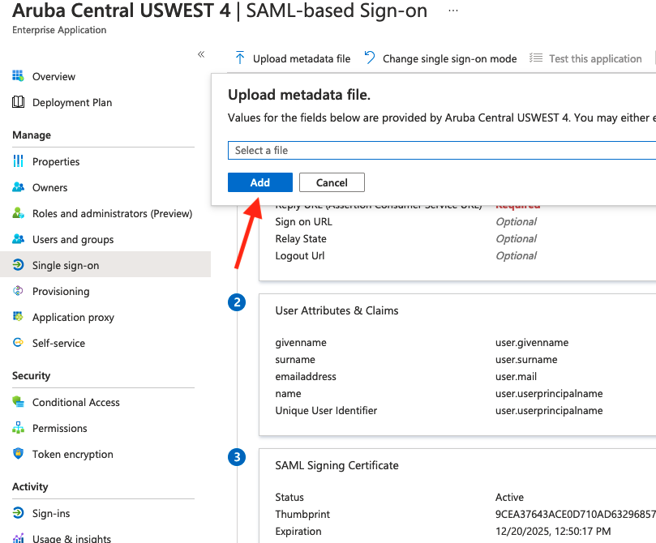
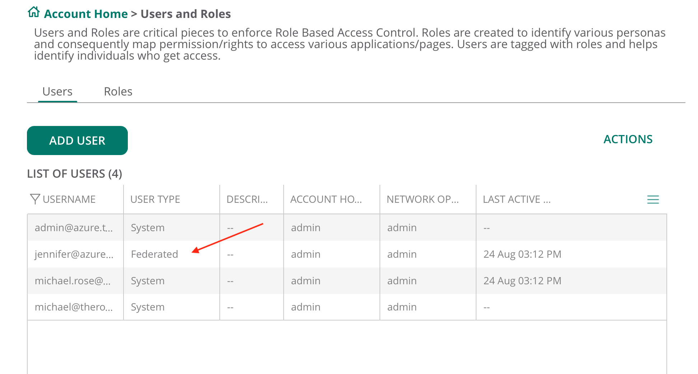

# Aruba Central - SAML SSO

## Azure AD Integration Guide

### Before you Begin

Go through the [SAML SSO feature description](https://help.central.arubanetworks.com/2.5.3/documentation/online_help/content/nms/user-mgmt/saml-profile-conf.htm?Highlight=SSO) to understand how [SAML](https://help.central.arubanetworks.com/2.5.3/documentation/online_help/content/nms/user-mgmt/saml-profile-conf.htm?Highlight=SSO) framework works in the context of Aruba Central.

In Azure AD, create a Group (Ex: Aruba Central Admins) and add the users that should have access to Aruba Central to this new group. This group will be used to grant access to Aruba Central using the users Azure AD credentials.

### Steps to Configure SSO/SAML Application in Azure AD
To configure SSO in Aruba Central, first download the metadata file from Azure AD.


<ol>
<li>Create an Enteprise Application in the [Azure Portal](https://portal.azure.com)</li>
<li>Upload the azure-metadata file from Azure to Aruba Central</li>
<li>Download the aruba-central-metadata file from Aruba Central</li>
<li>Upload the aruba-central-metadata file to Azure </li>
</ol>


### Step 1: Create an Azure AD Enterprise Application

* Log into to Azure portal.

* Click **Enterprise Applications** (you may need to search for it, if it's not on your menu)

* Click **New Application**


* Click **Create your own Application**
  
  Enter the name of your app. (Ex: Aruba Central USWEST 4)

* Select **Integrate any other application you don't find in the gallery (Non-gallery)**
* Under Step 1: Assign users and groups, select the AD Group you created at the beginning of this document.

* Under Step 2: Set Up Signle sign on
* The default setting is Disabled. Select **SAML** 

* Click **Download** under Step 3 : Federation Metadata XML



### Step 1A: Add Aruba Central Custom Attributes
***Attributes Statement***

*For the purpose of this guide, the values are static. The customer will most likely changes these to dynamic values, as this will 
control what access to services (read/write) each user will be granted. This guides creats a AD Group that grants ADMIN access to Aruba Central. Additional AD Groups should be created for read-only access.*

```
aruba_1_cid = <customer-id>  
 # app1, scope1 
 aruba_1_app_1 = central 
 aruba_1_app_1_role_1 = <readonly> 
 aruba_1_app_1_group_1 = groupx, groupy 
 aruba_1_app_2 = device_profiling 
 aruba_1_app_2_role_1 = <readonly> 
 aruba_1_app_3 = account_setting 
 aruba_1_app_3_role_1 = <readonly> 
```

Please refer to the Aruba Central documentation for additional information on SSO attributes: [Configuring Service Provider Metadata in IdP](https://help.central.arubanetworks.com/2.5.3/documentation/online_help/content/nms/user-mgmt/conf-idp-attributes.htm)


#### Edit User Attributes
* The user attributes are required attributes required by Central to identify the customer, user and application.



#### Claim values

* The groups is set to whatever AD Group you created for Aruba Central





### Step 2: Create Aruba Central SSO for Azure AD

* Log into Aruba Central
* From the **Account Home**, select **Single-Sign-On**
* Enter your domain name. The domain name must be the email address for the user logging. (Ex: @arubanetworks.com) This is how Aruba Central knows to redriect the authentication request to Azure AD.
* Click **Add SAML PROFILE**
 
* You'll upload the federated metadata file you downloaded from Azure in the previous step. Click METADATA FILE and Browse. Locate the file you downloaded and upload it to Aruba Central. 




* Then download the Aruba Central metadata file



* Then upload the metadata file (domain_metadata.xml) to Azure AD Enterprise App that you created.




### Login to Central using Azure AD
* Once you've completed the above steps, login to central using your Azure AD email.


* If everything is working correctly, you should have logged into Aruba Central and are viewing the Overview page.


### Validation
* Go to Account Home -> User Roles in Central.
You should see your user has logged and their user type is ***Federated***



### Using Azure AD MFA
* By default, Azure AD enables MFA. However, for testing and demos, it's much easier to disable MFA on your accounts. To disable MFA, please see the following documentation: [What are security defaults](https://docs.microsoft.com/en-us/azure/active-directory/fundamentals/concept-fundamentals-security-defaults)


### Troubleshooting
* There's a useful 3rd party browser tool called: SAML Tracer
* This tool will allow you to verify the attributes you're sending to Central.
* It can be useful when configuratin SAML with multiple Central accounts or domains


* For additonal troubleshooting steps, please refer to the Troubleshooting section of the Aruba Central documentation: [Troubleshooting SAML SSO Authentication Issues](https://help.central.arubanetworks.com/2.5.3/documentation/online_help/content/nms/user-mgmt/trblsht-saml.htm). 


